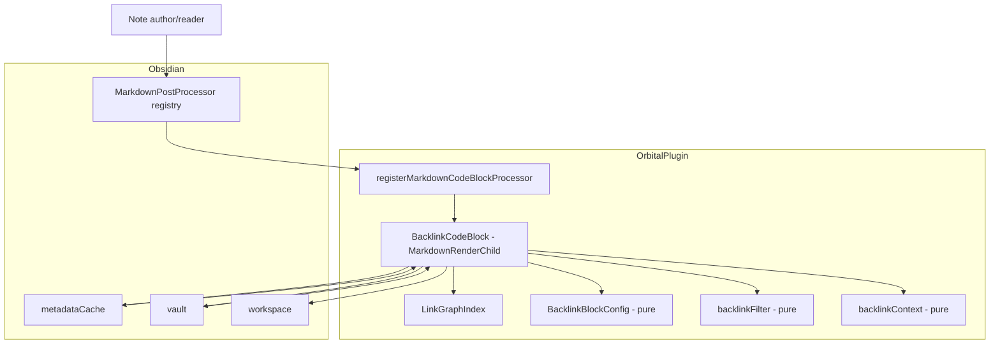
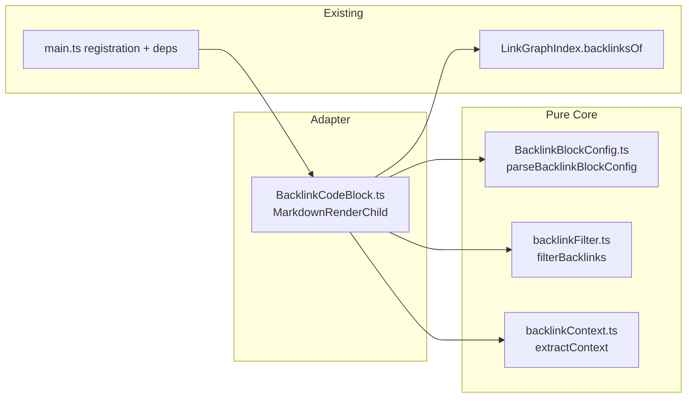
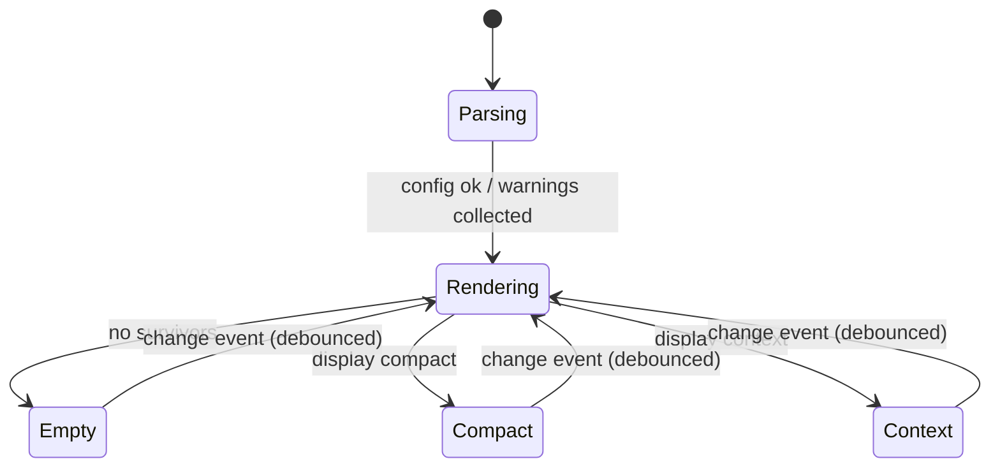

# Solution Design Document

## Validation Checklist

### CRITICAL GATES (Must Pass)

- [x] All required sections are complete
- [x] No [NEEDS CLARIFICATION] markers remain
- [x] Architecture pattern is clearly stated with rationale
- [x] **All architecture decisions confirmed by user**
- [x] Every interface has specification

### QUALITY CHECKS (Should Pass)

- [x] All context sources are listed with relevance ratings
- [x] Project commands are discovered from actual project files
- [x] Constraints → Strategy → Design → Implementation path is logical
- [x] Every component in diagram has directory mapping
- [x] Error handling covers all error types
- [x] Quality requirements are specific and measurable
- [x] Component names consistent across diagrams
- [x] A developer could implement from this design

---

## Constraints

- **CON-1** — TypeScript, Obsidian API `>=1.5.7`, ES modules, esbuild bundle to
  `main.js`; must run on **desktop and mobile** (`manifest.json` →
  `isDesktopOnly: false`). Target browserslist `chrome 114`.
- **CON-2** — House architecture: **pure, Obsidian-free core modules** (like
  `src/graph/relations.ts`, `src/graph/unlinkedMentions.ts`) unit-tested with
  vitest, wrapped by thin Obsidian-facing orchestrators; `src/main.ts` stays a
  thin wiring layer. ESLint `eslint-plugin-obsidianmd` + stylelint must pass.
- **CON-3** — No telemetry (see `PRIVACY.md`); DOM must be XSS-safe (no
  `innerHTML`); UI text sentence-case; community-directory rules apply. Reuse the
  existing link graph and native-styled rendering — no new runtime dependencies.

## Implementation Context

**IMPORTANT**: You MUST read and analyze ALL listed context sources to
understand constraints, patterns, and existing architecture.

### Required Context Sources

#### Documentation Context
```yaml
- doc: docs/ideas/2026-07-03-backlink-codeblock.md
  relevance: HIGH
  why: "Source idea — approved, gap-reviewed design this SDD implements"
- doc: docs/XDD/specs/002-backlink-codeblock/requirements.md
  relevance: HIGH
  why: "PRD — features and acceptance criteria this design must satisfy"
- doc: docs/ai/memory/decisions.md
  relevance: HIGH
  why: "Records the native-CSS-class + pure-core patterns to mirror (unlinked mentions)"
- doc: docs/ai/memory/domain.md
  relevance: MEDIUM
  why: "Tag/mention matching rules established for the plugin"
```

#### Code Context
```yaml
- file: src/main.ts
  relevance: HIGH
  why: "Where the codeblock processor is registered; event wiring, _isExcluded, index lifecycle, debounce pattern (main.ts:272)"
- file: src/graph/LinkGraphIndex.ts
  relevance: HIGH
  why: "backlinksOf(path) (line 117) is the backlink source; rename/remove/update lifecycle"
- file: src/graph/relations.ts
  relevance: HIGH
  why: "Reference for the pure-core signature style (predicates injected, no obsidian import)"
- file: src/graph/unlinkedMentions.ts
  relevance: HIGH
  why: "Reference pure scanner; offset/word-boundary handling patterns"
- file: src/links/MentionLinkService.ts
  relevance: HIGH
  why: "Native search-result CSS classes, cachedRead + buildSnippet pattern, click/hover wiring to mirror in context mode"
- file: src/view/panels/RelationsPanel.ts
  relevance: HIGH
  why: "Reference rendering: clickable titles, Keymap.isModEvent mod-click, hover-link event, empty-state wording, count header"
- file: src/shared/ExclusionMatcher.ts
  relevance: MEDIUM
  why: "Explains why the block needs a NEW filter (regex + frontmatter-only) — not reusable here"
- file: src/types/index.ts
  relevance: MEDIUM
  why: "OrbitalSettings (refreshDebounceMs), RelationItem shape"
- file: styles.css
  relevance: MEDIUM
  why: "Existing orbital- style hooks to extend for the block"
- file: @package.json
  relevance: MEDIUM
  why: "Build/test/lint scripts"
```

#### External APIs
Not applicable — the feature integrates only with the Obsidian plugin API
(local), no third-party services.

### Implementation Boundaries
- **Must Preserve**: existing `OrbitalView` sidebar behavior, `LinkGraphIndex`
  public API, `main.ts` event wiring, `MentionLinkService` behavior, current
  settings shape and defaults.
- **Can Modify**: `src/main.ts` (add registration + a codeblock deps factory),
  `styles.css` (add block style hooks), `src/types/index.ts` (only if a shared
  type is genuinely needed — prefer local types).
- **Must Not Touch**: dangling/recent subsystems, release/CI config, git hooks.

### External Interfaces

#### System Context Diagram


#### Interface Specifications
```yaml
inbound:
  - name: "Markdown codeblock processor"
    type: Obsidian API callback
    format: "fenced code block, language `orbital-backlinks`"
    authentication: none (local)
    data_flow: "raw block source + MarkdownPostProcessorContext (sourcePath, addChild) → rendered DOM"
  - name: "Vault + metadata events"
    type: Obsidian event bus
    format: "on('changed'|'create'|'delete'|'rename'|'resolved')"
    authentication: none
    data_flow: "change signals → debounced re-render"
outbound:
  - name: "Vault read"
    type: Obsidian API
    format: "vault.cachedRead(TFile): Promise<string>"
    data_flow: "source note content for context snippets"
    criticality: MEDIUM
data:
  - name: "LinkGraphIndex (in-memory)"
    type: plugin-scoped reverse link index
    connection: direct method calls (backlinksOf)
    data_flow: "subject path → source paths"
```

### Cross-Component Boundaries
Not applicable — single Obsidian plugin, single deployable artifact (`main.js`).

### Project Commands
```bash
# Discovered from package.json
Install: npm install
Dev:     npm run dev          # esbuild watch
Test:    npm test             # vitest run
Lint:    npm run lint         # eslint src/ && stylelint styles.css
Build:   npm run build        # tsc --noEmit + esbuild production
Coverage: npm run test:coverage
```

## Solution Strategy

- **Architecture Pattern:** Pure functional core + thin adapter. Three pure,
  Obsidian-free modules (parse, filter, snippet-extract) unit-tested in
  isolation; one `MarkdownRenderChild` orchestrator that wires the Obsidian
  runtime (index, cache, vault, workspace) into those pure functions and renders
  DOM. Mirrors the established `relations.ts` / `MentionLinkService` split.
- **Integration Approach:** Register a single codeblock processor in
  `main.ts.onload()` via a `_buildBacklinkDeps()` factory (same shape as the
  existing `_buildRelationsDeps()`), reusing the already-built `_index`,
  `_isExcluded`, and settings. No changes to the index or event core; the block
  subscribes to existing events for live refresh.
- **Justification:** Maximizes reuse and testability, avoids undocumented
  Obsidian internals (community-directory safe), and keeps `main.ts` thin.
- **Key Decisions:** see Architecture Decisions (ADR-1…ADR-6), all
  user-confirmed during brainstorming/research.

## Building Block View

### Components


### Directory Map
**Component**: orbital (single plugin)
```
.
├── src/
│   ├── codeblock/                       # NEW directory
│   │   ├── BacklinkBlockConfig.ts       # NEW: pure config parser
│   │   ├── backlinkFilter.ts            # NEW: pure folder/tag filter
│   │   └── BacklinkCodeBlock.ts         # NEW: MarkdownRenderChild orchestrator
│   ├── graph/
│   │   └── backlinkContext.ts           # NEW: pure snippet/window extraction
│   └── main.ts                          # MODIFY: register processor + _buildBacklinkDeps()
├── styles.css                           # MODIFY: .orbital-backlink-* style hooks
└── test/
    ├── codeblock/
    │   ├── BacklinkBlockConfig.test.ts  # NEW
    │   ├── backlinkFilter.test.ts       # NEW
    │   └── BacklinkCodeBlock.test.ts    # NEW (jsdom + obsidian mock)
    └── graph/
        └── backlinkContext.test.ts      # NEW
```

### Interface Specifications

#### Data Storage Changes
None. The feature is stateless; its only "configuration" is the block's own
markdown source, persisted as part of the note. No plugin settings added in v1.

#### Internal API Changes
Not an HTTP API. The internal module contracts are:

```typescript
// src/codeblock/BacklinkBlockConfig.ts  (pure — no obsidian import)
export type DisplayMode = "compact" | "context";

export interface BacklinkBlockWarning {
  message: string;               // e.g. "unknown key 'sort'"
}

export interface BacklinkBlockConfig {
  display: DisplayMode;          // default "compact"
  folderInclude: string[];       // normalized folder paths, no trailing slash
  folderExclude: string[];
  tagInclude: string[];          // normalized WITH leading '#', lowercased
  tagExclude: string[];
  warnings: BacklinkBlockWarning[];
}

export function parseBacklinkBlockConfig(rawText: string): BacklinkBlockConfig;

// Normalization rules applied by the parser (pure, no obsidian import):
//   Folders — trim; collapse duplicate '/'; strip leading/trailing '/';
//             preserve case (vault paths are case-sensitive); NO relative-path
//             resolution (a value containing '.'/'..' segments is kept verbatim
//             and simply won't match). Vault root is the empty string "".
//   Tags    — trim; strip a single optional leading '#'; lowercase; re-prefix
//             with '#'. Matching is therefore case-insensitive (Obsidian tags
//             are), so `tagsOf` output must also be lowercased at the call site.

// src/codeblock/backlinkFilter.ts  (pure — no obsidian import)
export interface BacklinkFilterDeps {
  tagsOf: (path: string) => string[];   // tags WITH '#' (wired to getAllTags)
  isExcluded: (path: string) => boolean; // Orbital global exclusion
}

export function filterBacklinks(
  backlinks: string[],           // source paths from LinkGraphIndex, in index order
  subjectPath: string,
  config: BacklinkBlockConfig,
  deps: BacklinkFilterDeps,
): string[];                     // surviving source paths, order preserved

// src/graph/backlinkContext.ts  (pure — no obsidian import)
export interface LinkOffset { start: number; end: number; }

export interface ContextSnippet {
  lineIndex: number;             // source line (for stable keys / ordering)
  before: string;                // up to WINDOW chars, '…' if truncated at word boundary
  match: string;                 // the link display text at the window center
  after: string;                 // up to WINDOW chars, '…' if truncated
  matchCount: number;            // # of link occurrences on this line (>=1)
}

/**
 * Build ONE windowed snippet per link line (deduped by line index).
 * The window is centered on the FIRST link occurrence on that line.
 *
 * Highlighting contract (renderer side): the renderer applies
 * `search-result-file-matched-text` to every substring of
 * `before + match + after` equal to `match`. When `matchCount > 1` (multiple
 * links to the subject on the same line), all in-window occurrences are thus
 * highlighted. Accepted v1 limitation: a coincidental non-link occurrence of the
 * same text within the window would also be highlighted — acceptable because the
 * window is small and the text is the note's own name.
 */
export function extractContext(
  content: string,
  links: LinkOffset[],
  windowChars: number,           // 90 (per side)
): ContextSnippet[];

// src/codeblock/BacklinkCodeBlock.ts  (obsidian-facing)
export interface BacklinkDeps {
  index: LinkGraphIndex;
  app: App;                      // metadataCache, vault, workspace
  getSettings: () => OrbitalSettings;
  isExcluded: (path: string) => boolean;
}

export class BacklinkCodeBlock extends MarkdownRenderChild {
  constructor(containerEl: HTMLElement, rawSource: string, sourcePath: string, deps: BacklinkDeps);
  onload(): void;                // parse once, first render, subscribe to events
  onunload(): void;              // handled via this.register/registerEvent cleanup
}
```

Registration in `src/main.ts.onload()`:
```typescript
this.registerMarkdownCodeBlockProcessor("orbital-backlinks", (source, el, ctx) => {
  ctx.addChild(new BacklinkCodeBlock(el, source, ctx.sourcePath, this._buildBacklinkDeps()));
});
```

#### Application Data Models
No persistent entities. Transient value objects only: `BacklinkBlockConfig`,
`ContextSnippet` (defined above). Source display names reuse the existing
`toItem`/`RelationItem` convention (basename without extension).

#### Integration Points
```yaml
Obsidian API:
  - registerMarkdownCodeBlockProcessor(lang, handler)  # reading view + live preview
  - MarkdownPostProcessorContext.sourcePath / addChild
  - MarkdownRenderChild.onload/onunload/register/registerEvent
  - metadataCache.getFileCache(file).links[].position.{start,end}.offset
  - getAllTags(cache)                                  # inline + frontmatter, with '#'
  - vault.cachedRead(file)
  - vault.getFileByPath(path) / getAbstractFileByPath
  - normalizePath(raw)
  - Keymap.isModEvent(evt)                             # mod-click → new tab
  - workspace.trigger('hover-link', …)                # native page preview
LinkGraphIndex:
  - backlinksOf(subjectPath): string[]                # source of truth for backlinks
```

### Implementation Examples

#### Example: Filter precedence (exclude wins across categories)

**Why this example**: The include/exclude/AND/OR precedence is the subtlest
business rule; a wrong short-circuit order silently shows/hides the wrong notes.

```typescript
// backlinkFilter.ts — the decision for a single source path
function passes(path: string, subjectPath: string, cfg: BacklinkBlockConfig, deps: BacklinkFilterDeps): boolean {
  if (path === subjectPath) return false;          // Rule 6: no self-link
  if (deps.isExcluded(path)) return false;         // Rule 5: global exclusion

  const folder = parentFolder(path);               // "" for vault root
  const tags = deps.tagsOf(path);                  // e.g. ["#active/now", "#draft"]

  // includes (OR within category; empty include list = no constraint)
  if (cfg.folderInclude.length && !cfg.folderInclude.some(f => inFolder(folder, f))) return false;
  if (cfg.tagInclude.length   && !cfg.tagInclude.some(t => hasTag(tags, t)))         return false;

  // excludes evaluated last — ALWAYS win
  if (cfg.folderExclude.some(f => inFolder(folder, f))) return false;
  if (cfg.tagExclude.some(t => hasTag(tags, t)))        return false;

  return true;
}

// segment-boundary folder match: "Research" matches "Research" and "Research/x", NOT "Researchers"
function inFolder(sourceFolder: string, filterFolder: string): boolean {
  return sourceFolder === filterFolder || sourceFolder.startsWith(filterFolder + "/");
}
// nested tag match: "#active" matches "#active" and "#active/now"
function hasTag(tags: string[], filterTag: string): boolean {
  return tags.some(t => t === filterTag || t.startsWith(filterTag + "/"));
}
```

**Traced walkthrough** — config `folder: a/b`, `folder-exclude: a`, no tag
filters; source `a/b/note.md` with tags `[#active]`:

| Step | Check | Result |
|------|-------|--------|
| self-link | `a/b/note.md` === subject? | no → continue |
| global exclude | `isExcluded`? | no → continue |
| include-folder | folder `a/b` in `[a/b]`? | yes → passes include |
| include-tag | none set | skip |
| exclude-folder | folder `a/b` in `[a]`? `"a/b" === "a"`? no; `"a/b".startsWith("a/")`? **yes** | **excluded** |

→ Source **hidden**. Confirms "exclude wins" (PRD Feature 2, exclude-precedence AC).

#### Example: Windowed context snippet

**Why this example**: Clarifies the ~90-char/side window, word-boundary
truncation, and per-line dedup (multiple links on one line → one snippet).

```typescript
// backlinkContext.ts (sketch)
// 1. Map each link offset to its line via precomputed lineStart offsets.
// 2. Group by lineIndex; keep the FIRST link occurrence on a line as the window center,
//    but the renderer highlights every occurrence within the window.
// 3. Window = up to `windowChars` chars each side of the match, trimmed to the
//    nearest word boundary; prepend/append '…' when the line extends past the window.
// Example line (len ~190):
//   "…we decided that the migration to the new indexing layer described in
//    [[This Note]] should happen before the mobile release, pending review by…"
// windowChars=90 → before/after each snapped to a space, wrapped in '…'.
```

**Edge cases**:
- Link at start of line → `before` empty, no leading `…`.
- Two links same line → single `ContextSnippet` for that line (deduped);
  renderer highlights both occurrences.
- Two links on two lines → two `ContextSnippet`s under the same source group.

#### Test Examples as Interface Documentation
```typescript
// test/codeblock/backlinkFilter.test.ts (contract sketch)
describe("filterBacklinks", () => {
  it("segment-boundary folder match: 'Research' excludes 'Researchers/x'", () => {/* … */});
  it("nested tag include: '#active' matches source tagged '#active/now'", () => {/* … */});
  it("exclude wins over include across categories", () => {/* … */});
  it("empty include lists impose no constraint", () => {/* … */});
  it("drops the subject's own path (self-link) and globally-excluded paths", () => {/* … */});
});
```

## Runtime View

### Primary Flow: Render a backlinks block
1. Obsidian invokes the registered processor with `source`, `el`, `ctx`.
2. `main.ts` constructs a `BacklinkCodeBlock` and calls `ctx.addChild(...)`.
3. `onload()` parses config once (`parseBacklinkBlockConfig`), does the first
   async `render()`, and subscribes to change events (own debouncer).
4. `render()`: resolve subject `TFile` from `ctx.sourcePath` → `index.backlinksOf`
   → `filterBacklinks` (tags via `getAllTags`, global `isExcluded`) → render
   compact or context; context reads each surviving source via `cachedRead`
   (capped at ~50) and builds windowed snippets.
5. On a relevant vault/metadata event, the debounced handler re-runs `render()`.

```mermaid
sequenceDiagram
    actor User
    participant OB as Obsidian
    participant M as main.ts
    participant B as BacklinkCodeBlock
    participant I as LinkGraphIndex
    participant F as backlinkFilter
    participant V as vault.cachedRead

    User->>OB: open/preview note with block
    OB->>M: processor(source, el, ctx)
    M->>B: new BacklinkCodeBlock(...) ; ctx.addChild
    B->>B: parseBacklinkBlockConfig(source)
    B->>I: backlinksOf(sourcePath)
    I-->>B: source paths (index order)
    B->>F: filterBacklinks(paths, cfg, {tagsOf, isExcluded})
    F-->>B: surviving paths
    alt display: context
        loop up to 50 sources
            B->>V: cachedRead(source)
            V-->>B: content → extractContext → snippets
        end
    end
    B-->>OB: rendered DOM (compact list or context groups)
    Note over B: on metadata/vault change → debounced render()
```

### Error Handling
- **Unknown key / invalid `display`**: parser records a `warning`; block renders
  with valid lines + defaults; a subtle inline notice lists the warning(s).
- **Subject file missing / unreadable cache**: render the empty state
  ("No backlinks.") rather than throwing.
- **`cachedRead` rejects for a source (context mode)**: skip that source's
  snippet, continue with the rest; never abort the whole block.
- **Any unexpected throw in `render()`**: caught; render a contained inline error
  message; the rest of the note is unaffected.
- All user/derived text inserted via `textContent`/`createSpan` — never
  `innerHTML`.

### Complex Logic
```
ALGORITHM: render()
INPUT: config (parsed), sourcePath
OUTPUT: DOM in containerEl

1. subject <- vault.getFileByPath(sourcePath); if null -> renderEmpty(); return
2. sources <- index.backlinksOf(sourcePath)                 # index order
3. survivors <- filterBacklinks(sources, sourcePath, config,
                    { tagsOf: p -> getAllTags(cache.getFileCache(fileOf(p))) ?? [],
                      isExcluded })
4. clear containerEl; render header "Backlinks: <survivors.length>"
5. IF survivors empty:
     renderEmpty(config has any filter ? "No backlinks matching filters." : "No backlinks.")
     go to 8
6. IF display == compact:
     for each survivor -> clickable title row (open on click, new tab on mod-click, hover-link)
7. ELSE (context):
     capped <- survivors.slice(0, 50)
     for each survivor in capped:
        content <- await vault.cachedRead(fileOf(survivor))
        links   <- cache.getFileCache(fileOf(survivor)).links filtered to those resolving to subject
        snippets<- extractContext(content, offsets(links), 90)
        render source group + snippet rows (highlight match)
     if survivors.length > 50: render "… and (survivors.length - 50) more"
8. render parser warnings (if any) as subtle inline notice
```

## Deployment View

### Single Application Deployment
- **Environment**: runs inside Obsidian (desktop + mobile) as part of the bundled
  `main.js`. No server, no network.
- **Configuration**: none required; no new settings in v1. Uses existing
  `settings.refreshDebounceMs`.
- **Dependencies**: Obsidian API only; the already-built `LinkGraphIndex`.
- **Performance**: compact render O(#backlinks), no file reads; context render
  bounded to ≤50 `cachedRead`s (memoized by Obsidian), coalesced by the per-block
  debouncer.

### Multi-Component Coordination
Not applicable (single artifact). No migration, no feature flags.

## Cross-Cutting Concepts

### Pattern Documentation
```yaml
- pattern: pure-core + thin-adapter (see src/graph/relations.ts, src/links/MentionLinkService.ts)
  relevance: CRITICAL
  why: "Testability + no obsidian import in core; matches repo convention"
- pattern: native-CSS-class reuse with parallel orbital- hooks (docs/ai/memory/decisions.md)
  relevance: HIGH
  why: "Inherit theme + native Backlinks look; stable test/style selectors"
- pattern: per-instance lifecycle cleanup via MarkdownRenderChild.register/registerEvent
  relevance: HIGH
  why: "No listener leaks across view toggles"
```

### User Interface & UX

**Information Architecture:** the block is inline document content; no navigation.
Header line "Backlinks: N", then either a compact list or context groups.

**Design System:** reuse Obsidian native classes + Orbital hooks —
- compact row: `tree-item` / `nav-file-title` + `.orbital-backlink-item`
- context group: `search-result` / `search-result-file-title` +
  `.orbital-backlink-group`
- snippet: `search-result-file-match` + `.orbital-backlink-snippet`; highlight via
  native `search-result-file-matched-text`
- count: `.orbital-backlink-count`; empty/warning: `.orbital-backlink-empty` /
  `.orbital-backlink-notice`
- Colors from theme tokens (`--text-normal/-muted/-faint/-accent`); no hardcoded
  colors.

**Interaction Design:**
- Click a source title → open note; **mod-click** (`Keymap.isModEvent`) → new tab
  (parity with `RelationsPanel`).
- Hover a title → fire `hover-link` so core page-preview works.
- Context groups always expanded (no collapse in v1).

**Accessibility:** clickable titles keyboard-focusable and in tab order;
count header conveys semantic meaning ("N backlinks"); empty state announced;
contrast inherited from theme tokens; mobile touch targets ≥44px for any tappable
row.

#### UI Visualization Guide

Compact:
```
┌───────────────────────────────┐
│ Backlinks: 3                   │
│ • Note Alpha                   │
│ • Note Beta                    │
│ • Note Gamma                   │
└───────────────────────────────┘
```
Context:
```
┌────────────────────────────────────────────────┐
│ Backlinks: 2                                     │
│ Note Alpha                                       │
│   …described in [[This Note]] should happen …    │
│ Note Beta                                        │
│   …see the approach in [[This Note]] for the …   │
│   …again [[This Note]] appears near the end…     │
└────────────────────────────────────────────────┘
```
Filtered-empty: `Backlinks: 0` + `No backlinks matching filters.`



### System-Wide Patterns
- **Security**: local only; XSS-safe DOM building; no secrets.
- **Error Handling**: local, non-throwing; graceful inline messages (see Runtime
  View → Error Handling).
- **Performance**: per-block debounce at `refreshDebounceMs`; context read cap;
  no memoization needed (each block is single-subject scoped).
- **i18n/L10n**: English UI, sentence case (repo convention).
- **Logging**: reuse `this._log`/`createLogger` gate only if needed; no noisy
  `console.log` (use `console.debug`).

### Multi-Component Patterns
Not applicable.

## Architecture Decisions

- [x] **ADR-1 Codeblock processor over embedding native BacklinkView**: use
  `registerMarkdownCodeBlockProcessor` + own rendering.
  - Rationale: no undocumented internals → community-directory safe, mobile-safe,
    full control over filters/modes.
  - Trade-offs: we implement context snippet rendering ourselves.
  - User confirmed: **Yes (brainstorming, 2026-07-03 — "Ansatz 1")**

- [x] **ADR-2 Pure-core + thin-adapter module split**: `BacklinkBlockConfig`,
  `backlinkFilter`, `backlinkContext` pure; `BacklinkCodeBlock` adapter.
  - Rationale: matches `relations.ts`/`MentionLinkService`; unit-testable core.
  - Trade-offs: a little more wiring than a single class.
  - User confirmed: **Yes (design approval, 2026-07-03)**

- [x] **ADR-3 New filter engine, not ExclusionMatcher**: simple folder-prefix +
  `getAllTags` (inline+frontmatter) matching.
  - Rationale: `ExclusionMatcher` is regex + frontmatter-only — wrong semantics.
  - Trade-offs: new code (small, pure, tested).
  - User confirmed: **Yes (gap review, 2026-07-03)**

- [x] **ADR-4 Context snippet = single-line ~90-char/side window, groups always
  expanded**.
  - Rationale: user wants sentence context without needing collapse; windowing
    keeps rows short.
  - Trade-offs: very long lines are truncated (acceptable; `…` shown).
  - User confirmed: **Yes (2026-07-03)**

- [x] **ADR-5 Soft cap ~50 sources in context mode ("… and N more")**; compact
  uncapped.
  - Rationale: bound `cachedRead` cost on large backlink sets.
  - Trade-offs: context view not exhaustive beyond 50 (rare; noticed via notice).
  - User confirmed: **Yes (2026-07-03)**

- [x] **ADR-6 Default order = index order (`backlinksOf`)**, no sort in v1.
  - Rationale: deterministic, matches Relations tab; sort options parked.
  - Trade-offs: not alphabetical; acceptable for v1.
  - User confirmed: **Yes (2026-07-03)**

## Quality Requirements
- **Performance**: compact render performs **zero** file reads; context render
  performs ≤50 `cachedRead`s per pass; re-renders coalesced at
  `refreshDebounceMs` (300 ms default). No perceptible input lag while typing in
  a source note.
- **Usability**: renders identically in reading view and live preview; sentence-
  case copy consistent with the Relations tab; clear distinction between the two
  empty states.
- **Security**: no `innerHTML`; all text via `textContent`/`createSpan`.
- **Reliability**: no uncaught exceptions escape the block; no event-listener
  leaks across view toggles (verified by test); correct updates on
  create/delete/rename.

## Acceptance Criteria

**Main Flow (PRD Feature 1, 3)**
- [ ] WHEN a note with an empty `orbital-backlinks` block renders in reading view
      OR live preview, THE SYSTEM SHALL list all backlinks in compact mode with a
      "Backlinks: N" header.
- [ ] WHEN the user clicks a source title, THE SYSTEM SHALL open that note; WHERE
      the click is a mod-click, THE SYSTEM SHALL open it in a new tab.
- [ ] WHILE `display: context`, THE SYSTEM SHALL show, per source, one windowed
      (~90 char/side) highlighted snippet per link line, groups always expanded.

**Filtering (PRD Feature 2)**
- [ ] IF an include-folder is set AND a source is not within it (segment
      boundary, subfolders included), THEN THE SYSTEM SHALL hide that source.
- [ ] IF both an include-folder and an include-tag are set AND a source satisfies
      only one, THEN THE SYSTEM SHALL hide that source (AND across categories).
- [ ] IF a source matches any exclude-folder or exclude-tag, THEN THE SYSTEM SHALL
      hide it regardless of includes (exclude wins).
- [ ] THE SYSTEM SHALL match tags via inline and frontmatter tags, nested-aware,
      accepting config tags with or without a leading `#`.
- [ ] THE SYSTEM SHALL never list the subject note itself, and SHALL honor
      Orbital's global exclusions.
- [ ] IF active filters remove every backlink, THEN THE SYSTEM SHALL show
      "No backlinks matching filters."; otherwise the empty state SHALL read
      "No backlinks."

**Live refresh (PRD Feature 4)**
- [ ] WHEN a link to the subject is added/removed/edited elsewhere and saved, THE
      SYSTEM SHALL re-render the block (debounced) without manual refresh.
- [ ] WHEN a source is renamed or deleted, THE SYSTEM SHALL re-render accordingly.
- [ ] WHEN the note toggles between reading and editing views, THE SYSTEM SHALL
      NOT accumulate duplicate event listeners.

**Error handling (PRD Feature 5)**
- [ ] IF the config has an unknown key or invalid `display`, THEN THE SYSTEM SHALL
      render with defaults and show a subtle inline warning.
- [ ] IF rendering throws unexpectedly, THEN THE SYSTEM SHALL show a contained
      inline error and leave the rest of the note intact.

**Performance (Should-have cap)**
- [ ] WHILE `display: context` AND survivors > 50, THE SYSTEM SHALL render the
      first 50 and append "… and N more".

## Risks and Technical Debt

### Known Technical Issues
- Context mode multiplies `cachedRead` calls; mitigated by the ≤50 cap and
  Obsidian's read memoization.

### Technical Debt
- Reliance on non-public Obsidian CSS class names (`search-result`, `tree-item`)
  — pre-existing debt shared with `MentionLinkService`; mitigated by parallel
  `orbital-` hooks. Not newly introduced.

### Implementation Gotchas
- `getFileCache(source).links` includes links to *all* targets — filter to those
  resolving to the subject (via `getFirstLinkpathDest`/resolvedLinks) before
  building context snippets, or the snippet may highlight an unrelated link.
- Link `position.start/end.offset` are **character offsets**, not line/col — map
  to lines via precomputed line-start offsets.
- Live preview may re-invoke the processor on edits; rely on
  `MarkdownRenderChild` lifecycle for cleanup rather than manual bookkeeping.
- `getAllTags` returns tags **with** `#`; normalize config tags to match, and
  lowercase both sides for case-insensitive comparison consistent with Obsidian.
- Vault-root sources have an empty parent folder (`""`); ensure `inFolder`
  handles it (a root source matches only an empty/absent include-folder).

## Glossary

### Domain Terms
| Term | Definition | Context |
|------|------------|---------|
| Backlink | An incoming link: another note that links to the subject | The block's content |
| Subject note | The note that contains the codeblock | Always `ctx.sourcePath` |
| Source note | A note that links to the subject (a backlink) | Filtered by folder/tag |
| Compact mode | Display as a bare list of source titles | `display: compact` (default) |
| Context mode | Display each link's surrounding text window | `display: context` |

### Technical Terms
| Term | Definition | Context |
|------|------------|---------|
| MarkdownRenderChild | Obsidian lifecycle object mounted into rendered markdown | The orchestrator base class |
| Pure core | Module with no Obsidian import, unit-testable | Config/filter/context modules |
| Segment-boundary match | Path match only at `/` boundaries | Folder filter (`Research` ≠ `Researchers`) |

### API/Interface Terms
| Term | Definition | Context |
|------|------------|---------|
| `backlinksOf(path)` | LinkGraphIndex reverse lookup → source paths | Backlink source of truth |
| `getAllTags(cache)` | Obsidian helper → all tags (inline+frontmatter) with `#` | Tag filter input |
| `cachedRead(file)` | Obsidian memoized file read | Context snippet content |
| `Keymap.isModEvent` | Detects Cmd/Ctrl-click | Open-in-new-tab behavior |
